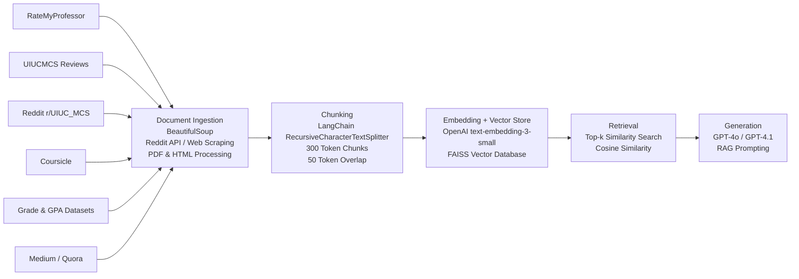

# Project 1 Planning: The Unofficial Guide

> Write this document before you write any pipeline code.
> Your spec and architecture diagram are what you'll use to direct AI tools (Claude, Copilot, etc.) to generate your implementation — the more specific they are, the more useful the generated code will be.
> Update the Retrieval Approach and Chunking Strategy sections if you change your approach during implementation.
> Update this file before starting any stretch features.

---

## Domain

<!-- What topic or category of knowledge does your system cover?
     Why is this knowledge valuable, and why is it hard to find through official channels?
     Example: "Student reviews of CS professors at [university] — useful because official
     course descriptions don't reflect teaching style, exam difficulty, or workload." -->
Topic Covered: Course and Professor reviews at UIUC - MCS program. 

This resource fills a gap not addressed by official UIUC websites by consolidating student feedback in one place. Instead of searching across multiple platforms, students can easily access reviews and insights to help inform their course and instructor selections.

---

## Document Sources

<!-- List every source you collected documents from.
     Be specific: include URLs, subreddit names, forum thread titles, or file names.
     Aim for variety — sources that together cover different subtopics or perspectives. -->

| # | Source | Type | URL or file path |
|---|--------|------|-----------------|
| 1 |Rate My Professor |Site |https://www.ratemyprofessors.com/search/professors/1112?q=*&did=11 |
| 2 |List of professors ranked excellent |College Webpage |https://siebelschool.illinois.edu/news/illinois-cs-places-28-faculty-on-citl-list-of-teachers-ranked-as-excellent-by-their-students |
| 3 |UIUC MCS course reviews|Webpage |https://uiucmcs.org/ |
| 4 |Student Blog |Medium |https://medium.com/@suvoo/the-actual-masters-experience-usa-17ed4adc2af3 |
| 5 |Student Discussions | Thread|https://www.quora.com/What-courses-in-UIUC-MCS-are-excellent-and-should-not-be-missed |
| 6 |UIUC MCS Reddit | Subreddit |https://www.reddit.com/r/UIUC_MCS/|
| 7 |Coursicle - course reviews |Webpage |https://www.coursicle.com/illinois/ |
| 8 |Grade disparity between courses |Webpage |[https://waf.cs.illinois.edu/discovery/grade_disparity_between_sections_at_uiuc/](https://waf.cs.illinois.edu/visualizations/Grade-Disparities-and-Accolades-by-Instructor/) |
| 9 |Coursicle - professor reviews | Webpage|https://www.coursicle.com/illinois/professors/ |
| 10 |GPA Dataset | Github Repo | https://github.com/wadefagen/datasets/tree/main/gpa |

---

## Chunking Strategy

<!-- Describe your chunking approach with enough specificity that someone else could reproduce it.
     Include:
     - Chunk size (characters or tokens) and why that size fits your documents
     - Overlap size and why (or why not) you used overlap
     - Any preprocessing you did before chunking (e.g., stripping HTML, removing headers)
     - What your final chunk count was across all documents -->

**Chunk size:**
250–350 tokens per chunk (target ~300 tokens)
**Overlap:**
50 tokens overlap
**Why these choices fit your documents:**
Our corpus consists primarily of:

Student course reviews
Reddit comments and discussion threads
RateMyProfessor reviews
Course writeups and blog posts
UIUCMCS reviews

Most reviews are relatively short (1–5 paragraphs) and contain a single opinion or experience about workload, difficulty, projects, grading, or teaching quality. Because the documents are opinion-based rather than long technical manuals, very large chunks would combine multiple unrelated ideas and reduce retrieval precision.

A chunk size of approximately 300 tokens is large enough to preserve the context of a student's review while remaining focused on a specific experience. For example, a review discussing workload, project difficulty, and instructor quality can usually fit within a single chunk, allowing the retrieval system to return a coherent opinion rather than fragmented sentences.

A 50-token overlap helps preserve information that may span chunk boundaries. For example, a reviewer might describe project difficulty at the end of one chunk and explain its impact on workload at the beginning of the next. The overlap ensures that important context is not lost and that either chunk remains retrievable.

---

## Retrieval Approach

<!-- Which embedding model are you using (e.g., all-MiniLM-L6-v2 via sentence-transformers)?
     How many chunks will you retrieve per query (top-k)?
     If you were deploying this for real users and cost wasn't a constraint, what tradeoffs
     would you weigh in choosing a different embedding model — context length, multilingual
     support, accuracy on domain-specific text, latency? -->

**Embedding model:**

**Top-k:**

**Production tradeoff reflection:**

---

## Evaluation Plan

<!-- List your 5 test questions with their expected correct answers.
     Questions should be specific enough that you can judge whether the system's response
     is right or wrong. "What are good dining halls?" is too vague.
     "What do students say about wait times at [dining hall name] during lunch?" is testable. -->

| # | Question | Expected answer |
|---|----------|-----------------|
| 1 | What do students commonly say about CS 225 regarding workload and difficulty? | Students generally describe CS 225 as one of the more demanding courses in the program. Reviews frequently mention a significant programming workload, challenging MPs/projects, and the need for consistent weekly effort. Despite the difficulty, many students consider it valuable for strengthening data structures and programming fundamentals. |
| 2 | Which UIUC MCS courses are most frequently recommended by students? | Courses that receive repeated positive recommendations include: CS 425 (Distributed Systems), CS 411 (Database Systems), CS 498 (Cloud Computing Applications),CS 441 (Applied Machine Learning). Students commonly praise these courses for practical applications, industry relevance, and strong project-based learning experiences. |
| 3 |What characteristics do students mention when reviewing Professor Mariana Raygoza? | Students generally describe Professor Mariana Raygoza as organized, approachable, and responsive to student questions. Reviews often mention clear communication, structured coursework, and a willingness to help students understand difficult material. |
| 4 |What factors make a course difficult according to UIUC MCS student reviews? |Students typically associate course difficulty with:Heavy weekly assignments, Large programming projects, Challenging exams, Significant reading requirements, Strict grading policies, Time-consuming group work, Workload is often cited as a stronger contributor to difficulty than the complexity of the material itself. |
| 5 |How do students use GPA and grade disparity information when selecting courses and instructors? |Students use GPA and grade disparity data as an additional decision-making tool when choosing sections and instructors. Reviews suggest that students compare instructor grading patterns, average GPAs, and historical outcomes alongside workload and teaching-quality reviews to evaluate overall course difficulty. |

---

## Anticipated Challenges

<!-- What could go wrong? Name at least two specific risks with reasoning.
     Consider: noisy or inconsistent documents, missing source attribution, off-topic
     retrieval, chunks that split key information across boundaries. -->

1.Conflicting or Subjective Student Opinions- One of the primary challenges of this knowledge base is that many sources contain subjective student experiences rather than objective facts. Different students may have very different opinions about the same course or professor based on their background, expectations, learning style, or semester. For example, one student may describe a course as manageable while another describes it as extremely difficult. Because the retrieval system aggregates information from multiple review platforms, it may retrieve conflicting opinions and generate summaries that do not fully represent the diversity of student experiences.

2. Noisy and Unverified Online Content- Several sources, including Reddit, Quora, and RateMyProfessor, contain user-generated content that is not verified by the university. Reviews may be outdated, biased, incomplete, or based on a single individual's experience. Some reviews may also contain exaggerated praise or criticism. As a result, the system may retrieve information that does not accurately reflect the current state of a course or instructor, especially if course content or teaching staff have changed over time.

---

## Architecture

<!-- Draw a diagram of your pipeline showing the five stages:
     Document Ingestion → Chunking → Embedding + Vector Store → Retrieval → Generation
     Label each stage with the tool or library you're using.
     You can use ASCII art, a Mermaid diagram, or embed a sketch as an image.
     You'll use this diagram as context when prompting AI tools to implement each stage. -->

---

## AI Tool Plan

<!-- For each part of the pipeline below, describe:
     - Which AI tool you plan to use (Claude, Copilot, ChatGPT, etc.)
     - What you'll give it as input (which sections of this planning.md, which requirements)
     - What you expect it to produce
     - How you'll verify the output matches your spec

     "I'll use AI to help me code" is not a plan.
     "I'll give Claude my Chunking Strategy section and ask it to implement chunk_text()
     with my specified chunk size and overlap" is a plan. -->
     
Tool used: Claude
The AI tools will be provided with the project requirements from this planning document, including the domain description, document sources, chunking strategy, pipeline architecture, and evaluation questions.

The AI tools will be used to generate code for document ingestion, preprocessing, chunking, embedding generation, vector database creation, retrieval, and answer generation. They may also be used to assist with debugging, prompt design, and integration of the different pipeline components.

Expected outputs include:
Python scripts for collecting and processing data from the selected sources
Chunking and document preprocessing implementations
Embedding and vector database setup code
Retrieval and ranking logic
Prompt templates and answer-generation workflows
Documentation and implementation guidance

Output quality will be verified through manual review and testing against the project requirements. Each component will be tested using the collected UIUC MCS review data, and the completed system will be evaluated using the predefined test questions. Verification will focus on whether the system retrieves relevant information, generates answers supported by the retrieved content, and produces responses that align with the expected results. Any outputs that do not satisfy the project specifications will be refined and retested before being incorporated into the final system.

**Milestone 3 — Ingestion and chunking:**

**Milestone 4 — Embedding and retrieval:**

**Milestone 5 — Generation and interface:**
